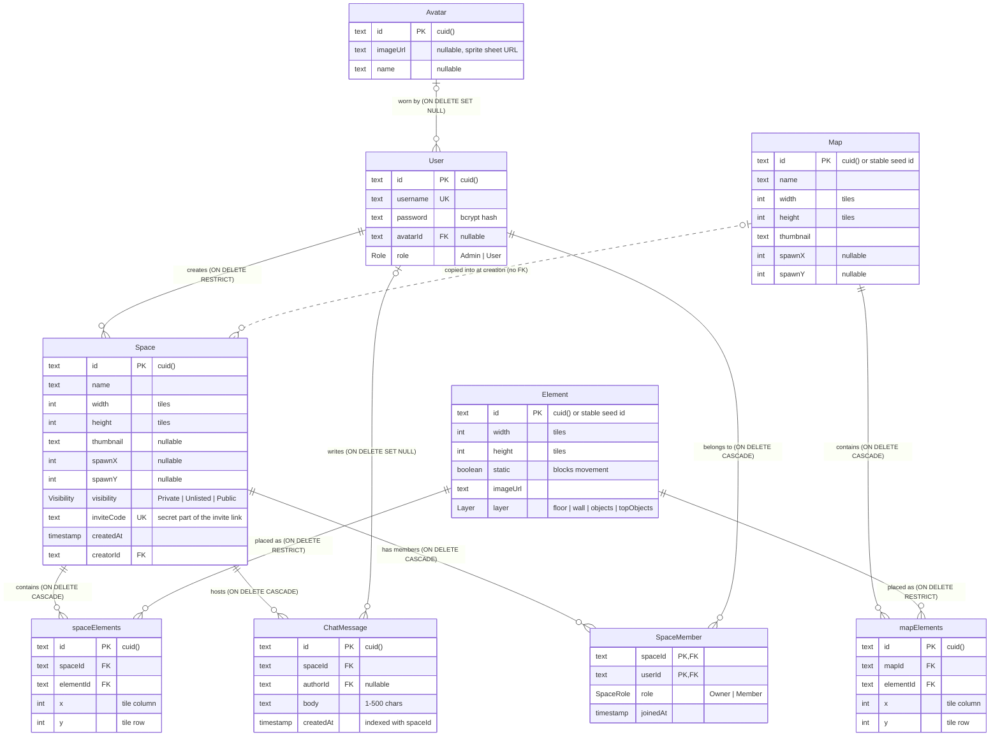
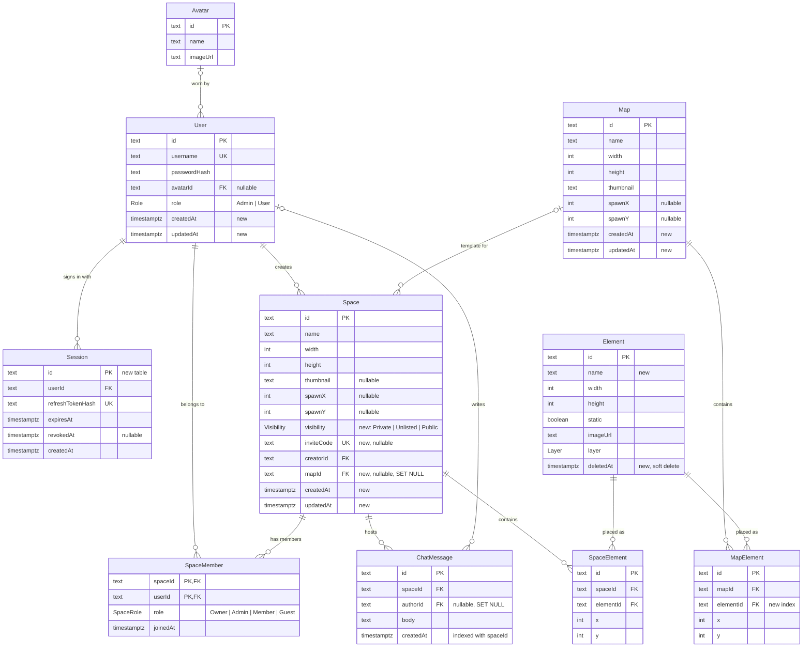

# VirtuSpace data model

Source of truth: [`packages/db/prisma/schema.prisma`](../../packages/db/prisma/schema.prisma).
This document reflects the database after migration `20260926000000_space_membership`
(PostgreSQL 16, Prisma 6). Constraint actions and indexes below were read from a
migrated database, not inferred from the Prisma file.

## Current schema

A **Map** is an admin-authored template. Creating a **Space** from a map copies the map's
size, thumbnail, spawn point and every `mapElements` row into `spaceElements`; after that the
space is independent, so editing a map never changes existing spaces. The dotted line marks
this copy relationship, which has no foreign key.

## Relationships

| Parent | Child | Cardinality | FK column | ON DELETE | ON UPDATE |
|---|---|---|---|---|---|
| Avatar | User | 0..1 to many | `User.avatarId` (nullable) | SET NULL | CASCADE |
| User | Space | 1 to many | `Space.creatorId` | RESTRICT | CASCADE |
| Space | spaceElements | 1 to many | `spaceElements.spaceId` | CASCADE | CASCADE |
| Element | spaceElements | 1 to many | `spaceElements.elementId` | RESTRICT | CASCADE |
| Map | mapElements | 1 to many | `mapElements.mapId` | CASCADE | CASCADE |
| Element | mapElements | 1 to many | `mapElements.elementId` | RESTRICT | CASCADE |
| Space | ChatMessage | 1 to many | `ChatMessage.spaceId` | CASCADE | CASCADE |
| User | ChatMessage | 0..1 to many | `ChatMessage.authorId` (nullable) | SET NULL | CASCADE |
| Space | SpaceMember | 1 to many | `SpaceMember.spaceId` | CASCADE | CASCADE |
| User | SpaceMember | 1 to many | `SpaceMember.userId` | CASCADE | CASCADE |

**Access rule:** a player may enter a space when they have a `SpaceMember` row, or when the space is
not `Private`. Entering an Unlisted/Public space, or a Private one with the correct `inviteCode`, creates
a `Member` row. The creator is the `Owner`. Enforced in both `apps/http/src/access.ts` and the WS join.

Chat messages are written by the WebSocket server (validated, max 500 characters, rate-limited
to a burst of 5 then one every 2 seconds). The last 50 are sent to a player when they join.

## Enums

| Enum | Values | Used by |
|---|---|---|
| `Role` | `Admin`, `User` | `User.role` |
| `Layer` | `floor`, `wall`, `objects`, `topObjects` | `Element.layer` |
| `Visibility` | `Private`, `Unlisted`, `Public` | `Space.visibility` (default `Unlisted`) |
| `SpaceRole` | `Owner`, `Member` | `SpaceMember.role` |

`Layer` drives both drawing order and collision (see the README's "Editing the campus map"):
`floor` never blocks, `wall` blocks its whole footprint, `objects` blocks its bottom row and is
depth-sorted with players, `topObjects` is drawn above players and never blocks.

## Indexes

| Table | Index | Columns | Notes |
|---|---|---|---|
| User | `User_pkey` / `User_id_key` | id | duplicate (see findings) |
| User | `User_username_key` | username | unique |
| Space | `Space_pkey` / `Space_id_key` | id | duplicate |
| Space | `Space_creatorId_idx` | creatorId | |
| spaceElements | `spaceElements_pkey` / `_id_key` | id | duplicate |
| spaceElements | `spaceElements_spaceId_idx` | spaceId | |
| spaceElements | `spaceElements_elementId_idx` | elementId | |
| mapElements | `mapElements_pkey` / `_id_key` | id | duplicate |
| mapElements | `mapElements_mapId_idx` | mapId | |
| ChatMessage | `ChatMessage_spaceId_createdAt_idx` | spaceId, createdAt | serves "latest N messages in a space" |
| Space | `Space_inviteCode_key` | inviteCode | unique |
| Space | `Space_visibility_createdAt_idx` | visibility, createdAt | serves the Explore page |
| SpaceMember | `SpaceMember_pkey` | spaceId, userId | composite primary key |
| SpaceMember | `SpaceMember_userId_idx` | userId | serves "spaces I've joined" |
| Element, Map, Avatar | `*_pkey` / `*_id_key` | id | duplicate |

## Findings for production

| Severity | Finding | Fix |
|---|---|---|
| High | `Element` rows referenced by a map or space cannot be deleted (RESTRICT), so `DELETE /admin/element/:id` returns a 500 for any element in use. | Soft-delete elements (`deletedAt`) and hide them from the palette, or block the delete with a clear 409. |
| High | A `User` who owns spaces cannot be deleted (RESTRICT). There is no account-deletion path. | Decide ownership on deletion: cascade the user's spaces, or transfer them, then change the FK action. |
| Medium | Every table declares `@id @unique`, which creates a second unique index on the primary key. Each write maintains two identical B-trees. | Drop `@unique` from the `id` fields; the migration drops the `*_id_key` indexes. |
| Medium | `mapElements.elementId` has no index (unlike `spaceElements.elementId`), so checking whether an element is used scans the table. | Add `@@index([elementId])` to `mapElements`. |
| Medium | Most tables have no `createdAt` / `updatedAt` (only `Space`, `SpaceMember` and `ChatMessage` do), so there is no audit trail. | Add `createdAt @default(now())` and `updatedAt @updatedAt` everywhere. |
| Low | Space does not remember which map it came from. | Add a nullable `Space.mapId` FK with ON DELETE SET NULL. |
| Low | Table names mix casing (`User`, `spaceElements`, `mapElements`). | Rename the models to PascalCase and keep the table names with `@@map`, so no data moves. |
| Low | Element placements have no uniqueness rule, so the same element can be stacked on the same tile. | Add `@@unique([spaceId, elementId, x, y])` (and the same for maps) after de-duplicating. |

## Target model (proposed)

This is the recommended next shape of the schema. New tables are marked **new**; columns
that do not exist yet are marked **new** in their comment. It adds refresh-token sessions so JWTs can
be revoked, and timestamps. `ChatMessage`, `SpaceMember` and space visibility already exist.

